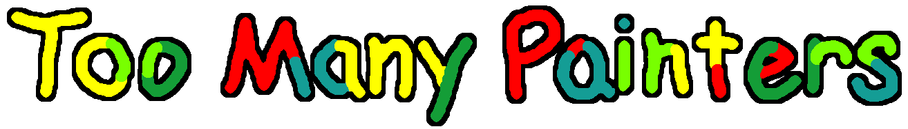

Too Many Painters is a browser-based multiplayer drawing game. Each round, a single guesser must try to guess a word. The remaining players, in some order, each get a random amount of colored ink to add to the drawing. Players get points for guessing correctly and for contributing to a successful drawing.

# Running
The backend can either statically host the built frontend or act as a headless backend. Either way, it is started by running `npm start` in the root directory.

To run the client in development mode, `cd` into the `client` directory and run `npm start`.

To statically build the client for production, run `npm run build` in the `client` directory.